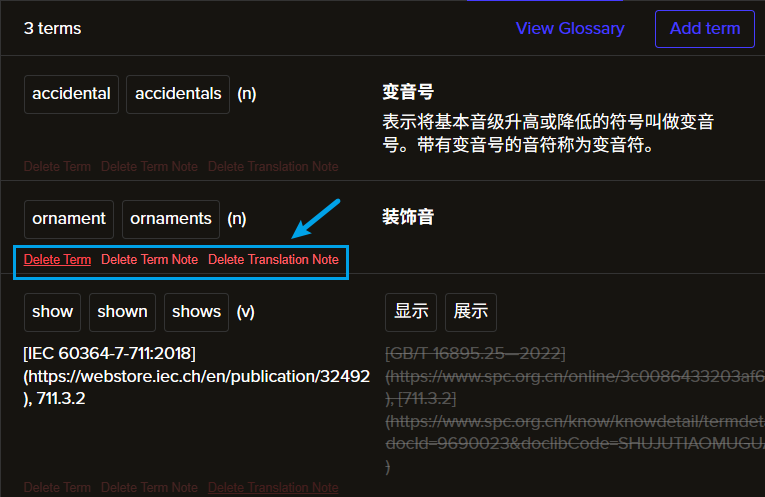

# Transifex-JS

My Tampermonkey Script for Transifex  
Transifex 平台自用油猴脚本

## Introduction

This Tampermonkey user script is designed to enhance the user experience on the [Transifex](https://app.transifex.com) web platform. It provides some functionalities to simplify some specific translation workflow.

### Features

Adds an action bar to every glossary item you see in the "Glossary" side tab, providing quick access to:

- Delete a glossary item
- Delete the source note of a glossary item
- Delete the translation note of a glossary item



## Development

### Debug with hot-reload

```bash
pnpm dev
```

### Build

```bash
pnpm build
```

## Licensing

This project is licensed under the MIT License. See the [License](https://github.com/isHarryh/Transifex-JS/blob/main/LICENSE) file for more details.
