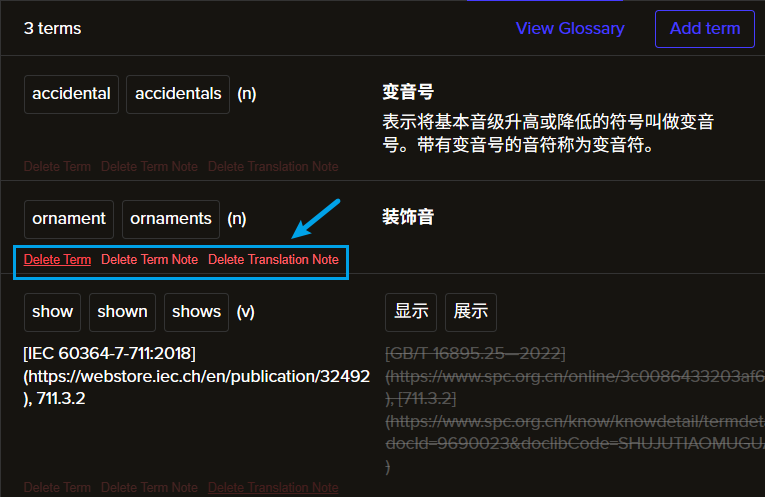

# Transifex-JS

My Tampermonkey Script for Transifex  
Transifex 平台自用油猴脚本

## Introduction

This Tampermonkey user script is designed to enhance the user experience on the [Transifex](https://app.transifex.com) web platform. It provides some functionalities to simplify some specific translation workflow.

### Features

Adds an action bar to every glossary item you see in the "Glossary" side tab, providing quick access to:

- Delete a glossary item
- Delete the source note of a glossary item
- Delete the translation note of a glossary item



## Getting Started

To install and use this script, follow these steps:

1. Add the [Tampermonkey](https://www.tampermonkey.net/) extension to your browser.
2. Open the file [dist/transifex-js.user.js](./dist/transifex-js.user.js) in this repository.
3. There're two ways to install the script:
   - Click the "Raw" button (in GitHub file page) to view the raw  code, then wait for Tampermonkey to prompt you to install the script.
   - Alternatively, you can copy the entire content of that code file and paste it into a new script in the Tampermonkey dashboard.
4. Enable "Developer Mode" in your browser's extension settings.
5. Navigate to any Transifex editor page and enjoy it!

## Development

### Debug with hot-reload

```bash
pnpm dev
```

### Build

```bash
pnpm build
```

## Licensing

This project is licensed under the MIT License. See the [License](https://github.com/isHarryh/Transifex-JS/blob/main/LICENSE) file for more details.
